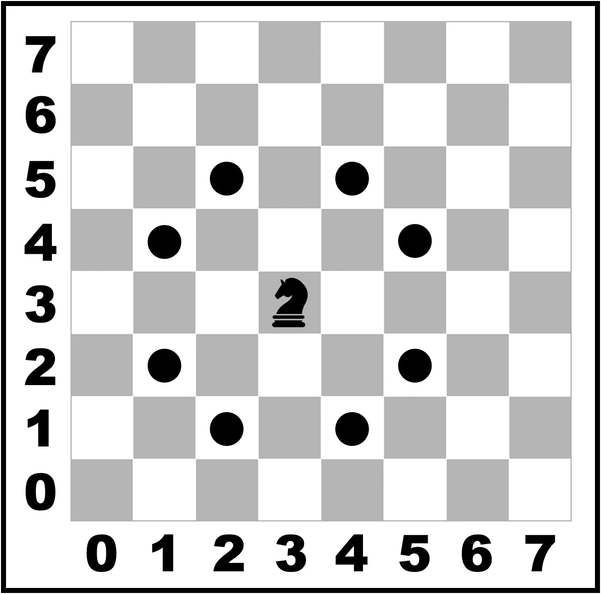

# Knights Travails
Find the shortest path a knight can take between two positions.

In chess, a knight can move in an "L" shape -- it can move two squares vertically and one square horizontally OR two squares horizontally and one square vertically. Given enough moves, a knight can eventually land on any square in a standard 8x8 chess board. The following visual shows all the possible places you can end up after one move.

The function `knightMoves` shows the shortest possible way to get from one square to another by outputting the coordinates of all squares a knight will pass along the way. Breadth-first search (BFS) is used to explore paths and reach the shortest one.

Run the script in the console using `node knights-travails.js`.